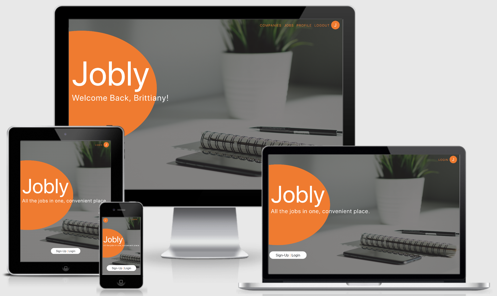

## Jobly - The Front End

<em>An online job board project complete with authentication and search functionality</em>

Jobly is a mobile frist responsive single page React application that will be using a progressive enhancement approach for cross-browser compatability (using flexbox when supported). The flexbox updates are a work in progress, but the navigation component updates are complete and can be viewed at this time.

* Once a user has registered and/or logged in, they gain access to the private routes only accessible by authenticating and they’re greeted with a personalized welcome message when on the home page.
* Users have the ability to browse all jobs and all companies, as well as search jobs by title and search companies by name.
* Users can also apply to jobs and edit information in their user profile.
* View Jobly back end source code [here](https://github.com/b-juravic/jobly-backend-express)

### Check out my [live demo](https://jobly.demo.brittianyjuravic.com/)!

--------------------------
## Installation & Setup

`npm install` 
Installs project dependencies

`npm start` 
Runs the app in the development mode 
Open [http://localhost:3000](http://localhost:3000) to view in the browser.

`npm test` 
Launches the test runner 
*Tests currently WIP

--------------------------
## Technology Notes

* Built with React, bootstrapped via [Create React App](https://github.com/facebook/create-react-app)
* [Axios](https://github.com/axios/axios) is used to make API requests
* [jwt-decode](https://www.npmjs.com/package/jwt-decode) is used to decode user's username from token once authenticated
* Capitalize [lodash](https://lodash.com/docs/4.17.15) utility function used for displaying authenticated user's first name in home page greeting

